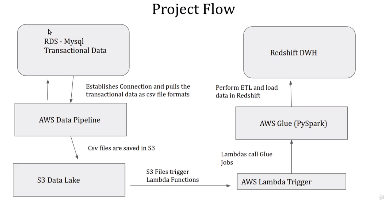

# Data-Engineering-AWS-Cloud

- AWS DataPipeline (Managing Jobs / Job Scheduler) 
- AWS Lamda (Trigger Glue Job)
- AWS Glue (Job / ETL / PySpark / Crawler)
- AWS Athena (fetching unstructured data in S3 as a query)
- AWS Redshift (vs GooleBigquery) : DWH / Trasaction / Cost by the Number of Node / Table is required / No Partion, But key
- AWS Redshift Spectrum (Data Enrichment / Multiple datasources)
- Quicksight (BI)

Dataset from kaggle brazilian ecommerce
